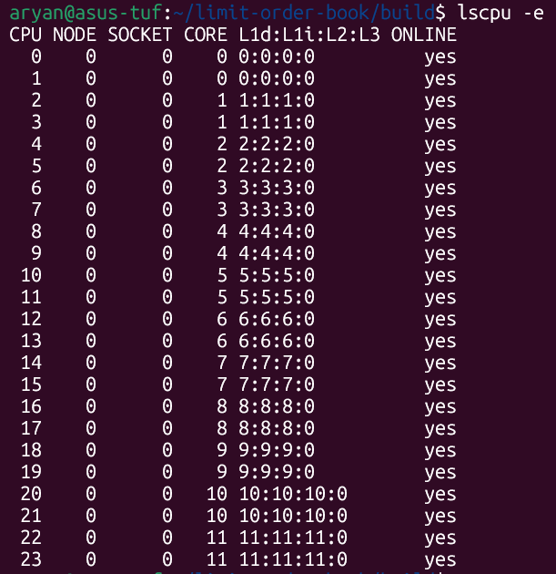
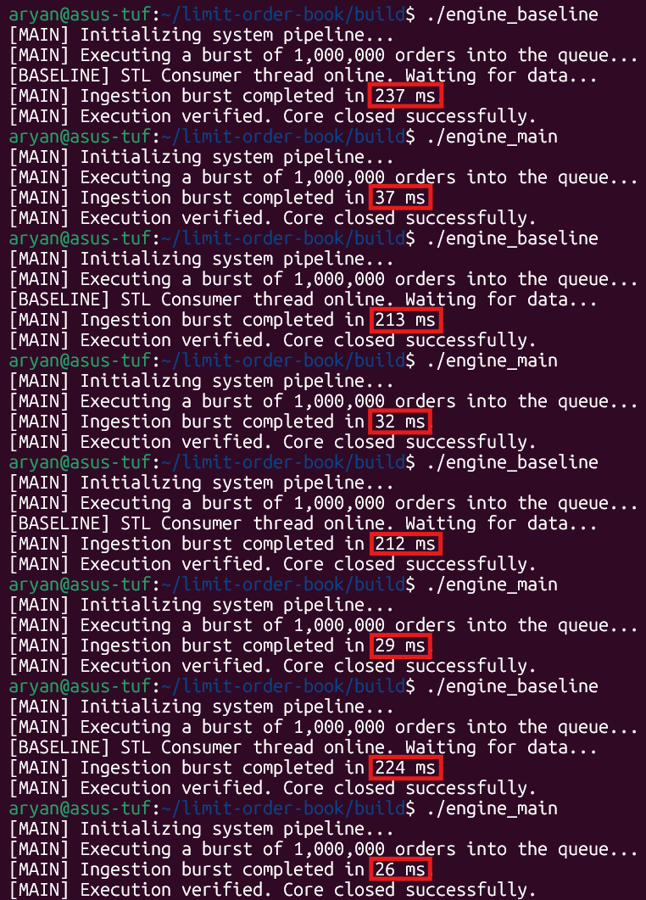
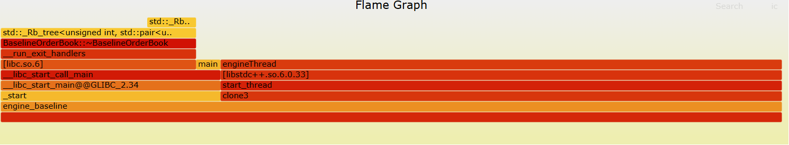
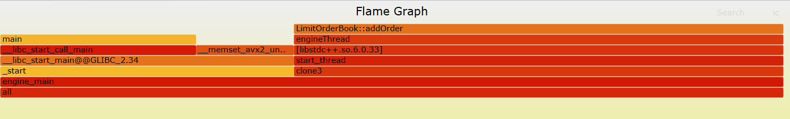
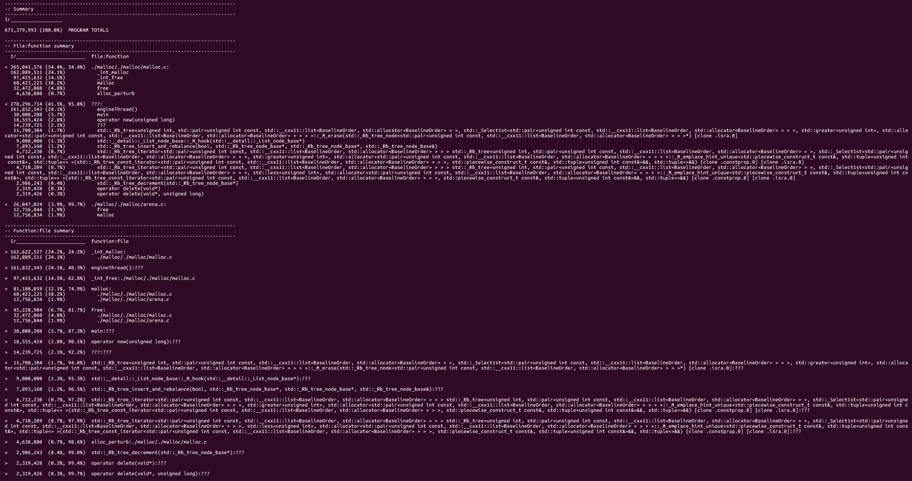
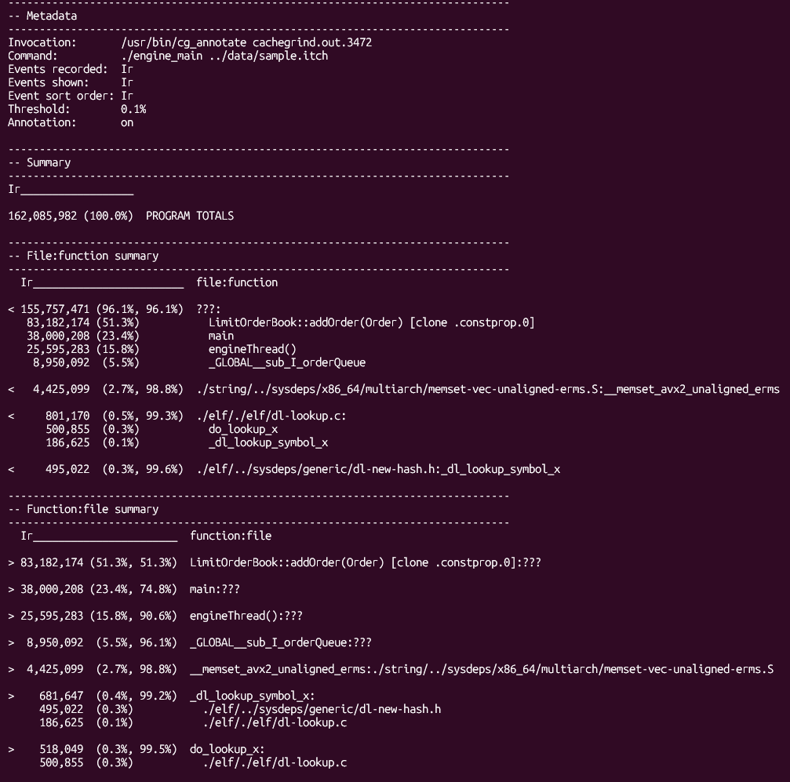
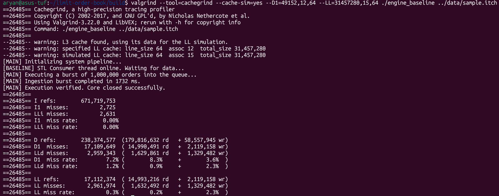
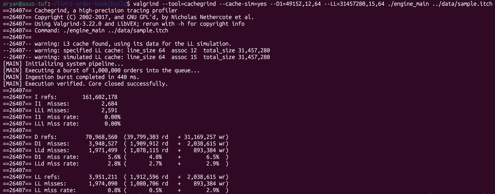

# NanoMatch — Limit Order Book Engine

A limit order book written in C++20, built to be as fast as possible. It reads NASDAQ ITCH 5.0 binary feeds or CSV files, matches orders by price-time priority, and processes them on a dedicated thread pinned to its own CPU core.

---

## Headline result

Ingesting 1,000,000 orders takes **~31ms** natively (**~32M orders/sec**), a
**~7.1x** speedup over a std::map-based baseline (**~221ms**, ~4.5M orders/sec).
The engine's per-order matching latency stays flat at **~9ns** regardless of
book depth, while the baseline degrades from ~10ns to ~22ns as the book fills up.

---

## How it works?

A parser thread (run on logical core 2) reads the feed file and pushes orders into a ring buffer. A separate engine thread (run on logical core 4) drains that buffer and runs the matching logic, thereby implementing an SPSC (**S**ingle **P**roducer **S**ingle **C**onsumer) queue. The two threads never share a lock. They communicate only through atomic reads and writes on the queue.

```
Parser Thread (Core 2)  ── [ring buffer] ──>  Engine Thread (Core 4)
    reads file                                  matches orders
  (mmap, zero-copy)                           (price-time priority)
```

*Note: Both the threads are pinned to physical cores such that they don't share an L2 cache\*, and Core 0 is avoided because the OS routes hardware interrupts there.*

*\* This was verified using the linux command `lscpu -e`*



*Clearly, the logical cores 2 and 4 belong to different physical cores.*

---

## Why it's fast

**No `std::map`.** The bid and ask sides are just flat arrays indexed by price — `bids[price]` gets you a price level in a single array lookup, regardless of how many other price levels exist. A `std::map` takes O(log N) time per lookup and gets measurably slower as the book fills up. The benchmarks below prove this out.

**Bitsets for best bid/ask tracking.** When a price level empties, the engine needs to find the next best price. Instead of scanning the array, it uses a compact array of 64-bit integers as a bitset, then uses a single CPU instruction (`__builtin_clzll` / `__builtin_ctzll`) to find the next set bit. The scan starts from the current best price, so it rarely looks at more than one word.

**Memory pool, pre-wired upfront.** All order nodes come from a slab of memory allocated at startup with `mmap(MAP_POPULATE)`. `MAP_POPULATE` tells the kernel to wire all the physical pages before any orders arrive, so there are no page faults at runtime. `MADV_HUGEPAGE` then groups that memory into 2 MB pages to reduce TLB pressure during large sweeps.

**32-byte node alignment.** Each `OrderNode` is exactly 32 bytes, so two fit neatly in a 64-byte L1 cache line. Traversing a price level's order queue reads two nodes per cache line fetch.

**Zero-copy file parsing.** Both parsers use `mmap` to map the file into virtual memory directly. There's no `fstream`, no intermediate buffer — the kernel's page cache is the read buffer. ITCH binary messages are decoded by casting a raw pointer straight to a packed struct, plus a byte-swap for big-endian fields.

---

## Benchmark results

### Test hardware

| | |
|---|---|
| CPU | Intel Core i7-14650HX (12 physical cores, 24 threads, 1 socket) |
| Cache | L1d 576 KiB · L1i 384 KiB · L2 24 MiB · L3 30 MiB |
| RAM | 7.6 GiB |
| OS | WSL2 (Ubuntu 24.04) on Windows, kernel 6.18.33.1-microsoft-standard-WSL2 |
| Compiler | g++ 13.3.0 (Ubuntu 13.3.0-6ubuntu2~24.04.1) |
| Build flags | `-O3 -march=native -mtune=native -flto` |

> WSL2 runs on a lightweight Hyper-V VM rather than bare metal — core pinning via `pthread_setaffinity_np` targets *virtual* CPU IDs exposed by WSL2, which are backed by, but not guaranteed to map 1:1 onto, physical Windows-scheduled cores. This is disclosed as a methodology caveat; it did not appear to affect the stability of the interleaved throughput runs (see below).

Each fixture runs 20 times; p50/p90/p99 are reported.

### Scaling: Engine vs. std::map baseline

The key result. The engine's latency stays flat at ~9 ns across 100 to 100,000 price levels. The `std::map` baseline climbs from ~10 ns to ~22 ns over the same range.

| Book depth | Baseline p50 | Baseline p99 | Engine p50 | Engine p99 |
|---|---|---|---|---|
| 100 levels | 10.3 ns | 27.8 ns | 9.13 ns | 9.49 ns |
| 1,000 levels | 12.0 ns | 26.4 ns | 9.17 ns | 9.43 ns |
| 10,000 levels | 13.4 ns | 16.6 ns | 9.15 ns | 9.34 ns |
| 100,000 levels | 21.5 ns | 29.4 ns | 9.14 ns | 9.61 ns |

### Other fixtures

**Ping-Pong** — a BUY order lands and immediately matches a resting SELL. This is the full lifecycle: insert, match, remove.

| p50 | p90 | p99 |
|---|---|---|
| 17.0 ns | 17.5 ns | 17.6 ns |

**Level Sweep** — one aggressive SELL sweeps through 100 resting BUY orders at the same price. 100 nodes removed in a single `addOrder` call.

| p50 | p90 | p99 |
|---|---|---|
| 384 ns | 390 ns | 391 ns |

That's about 3.8 ns per node swept, with almost no variance (1.2% CV) — the tight stddev shows the pool and cache alignment doing their job.

---

## End-to-end ingestion throughput

1,000,000 orders read from `data/sample.itch`, parsed, and matched — engine vs. std::map baseline, native (no profiler attached). Runs were interleaved (baseline, engine, baseline, engine, ...) to control for thermal/scheduling drift between measurements.

| Run | Baseline (ms) | Engine (ms) |
|---|---|---|
| 1 | 237 | 37 |
| 2 | 213 | 32 |
| 3 | 212 | 29 |
| 4 | 224 | 26 |
| **Average** | **~221.5 ms** | **~31 ms** |

**~7.1x speedup**, or roughly **~32M orders/sec** for the engine vs. **~4.5M orders/sec** for the baseline.



---

## Profiling evidence

### Flame graphs

**Baseline**: STL destructor teardown (`BaselineOrderBook::~BaselineOrderBook`) is visible as a distinct chunk of the graph, on top of the per-order rb-tree/list insertion cost.



**Optimized**: Dominated by `LimitOrderBook::addOrder` and `engineThread` directly; no allocator frames appear in the hot path.



### Cachegrind: instruction counts

| | Baseline | Optimized | Ratio |
|---|---|---|---|
| Total instructions (Ir) | 671,719,753 | 161,602,178 | **4.16x fewer** |

Baseline breakdown — allocator-related functions (`_int_malloc`, `_int_free`, `malloc`, `free`, `alloc_perturb`) account for **54.4%** of all instructions. The optimized build has no allocator frames in its top functions at all; `LimitOrderBook::addOrder` (51.3%) and `engineThread` (15.8%) dominate instead.





### Cachegrind: cache simulation (D1 / LL misses)

Cache parameters set to match this machine's actual topology (48 KiB L1d, 12-way; 30 MiB LL/L3, 15-way after Valgrind's power-of-two rounding), rather than generic defaults:

```bash
valgrind --tool=cachegrind --cache-sim=yes --D1=49152,12,64 --LL=31457280,15,64 ./engine_main ../data/sample.itch
valgrind --tool=cachegrind --cache-sim=yes --D1=49152,12,64 --LL=31457280,15,64 ./engine_baseline ../data/sample.itch
```

| Metric | Baseline | Optimized | Change |
|---|---|---|---|
| D refs | 238,374,577 | 70,968,560 | 3.4x fewer |
| D1 misses (absolute) | 17,109,649 | 3,948,527 | **4.3x fewer** |
| D1 miss rate | 7.2% | 5.6% | modest improvement |
| LLd miss rate | 1.2% | 2.8% | worse |

**Honest read:** the D1 miss *rate* only improves modestly, and the LLd miss rate is actually higher in the optimized build. The win isn't that each memory access became individually more cache-friendly — it's that the optimized engine performs 3.4x fewer memory accesses in total (no rb-tree traversal, no list node allocation), so the *absolute* number of D1 misses drops 4.3x even though the rate is similar. With a correctly-sized 30 MiB LL cache (comfortably large enough to hold both binaries' working sets), the baseline's more scattered rb-tree/list accesses actually get absorbed by the LL cache more effectively than the optimized engine's, which is why LLd miss rate moves in the baseline's favor here. This is consistent with the instruction-count finding above: removing the allocator/rb-tree overhead reduced total work, not just per-access efficiency.





> Note on methodology: `perf stat` / Intel VTune hardware counters were unavailable under WSL2, so cachegrind's software cache simulation was used instead. It doesn't require hardware perf counter access and gives directly comparable D1/LL miss statistics between baseline and optimized builds. Cache-sim parameters (`--D1`, `--LL`) were set to match this machine's real L1d/L3 sizes (see Test hardware above) rather than left at generic defaults, so the simulated miss rates reflect this CPU's actual cache capacity.

---

## File structure

```
├── LimitOrderBook.hpp/cpp   matching engine
├── Order.hpp                Order, OrderNode, PriceLevel structs
├── MemoryPool.hpp           mmap slab allocator
├── RingBuffer.hpp           lock-free SPSC queue
├── CSVParser.hpp            zero-copy CSV parser
├── ITCHParser.hpp           zero-copy ITCH 5.0 binary parser
├── BaselineOrderBook.hpp    std::map reference implementation (benchmarking only)
├── benchmark.cpp            Google Benchmark suite
├── main.cpp                 entry point, thread setup, timing
├── CMakeLists.txt           build config (-O3 -march=native -flto)
└── scripts/
    ├── csv_generator.py     generates 1M synthetic orders as CSV
    └── itch_generator.py    generates 1M synthetic orders as ITCH binary (~38 MB)
```

---

## Build & run

Requires CMake ≥ 3.14, a C++20 compiler, and Linux (uses `mmap`, `pthread_setaffinity_np`, `_mm_pause`).

```bash
mkdir build && cd build
cmake .. -DCMAKE_BUILD_TYPE=Release
make -j$(nproc)
```

Google Benchmark is fetched automatically at configure time.

Generate test data:

```bash
python3 scripts/itch_generator.py   # creates data/sample.itch
python3 scripts/csv_generator.py    # creates data/orders.csv
```

Run the ingestion engine (processes `data/sample.itch` by default):

```bash
./engine_main
```

Run benchmarks:

```bash
./engine_bench
```

To switch between CSV and ITCH, change the `filepath` variable in `main.cpp`.

---

## Supported feed formats

**CSV** — one order per line: `orderID,price,quantity,side` (0 = buy, 1 = sell).

**NASDAQ ITCH 5.0** — binary. Handles message types `A` (add order), `F` (add order with attribution), and `D` (delete order). Everything else is skipped.

---

## Limitations

- Prices must be integers below 100,000. No decimal scaling; orders at or above the ceiling are dropped.
- Order IDs must be below 1,100,001 (the size of the order map array).
- Linux only — `mmap`, `pthread_setaffinity_np`, and `__builtin_*` intrinsics are used throughout.
- The ring buffer is single-producer, single-consumer only.
- No persistence. Everything lives in memory; a crash loses the book state.
- Memory pool exhaustion (>1,100,000 live orders) is logged to stderr and the order is silently dropped rather than causing a resize/reallocation.