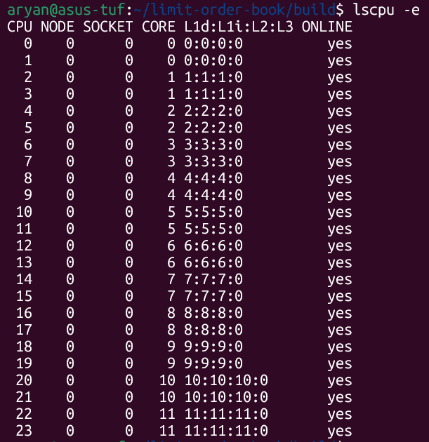
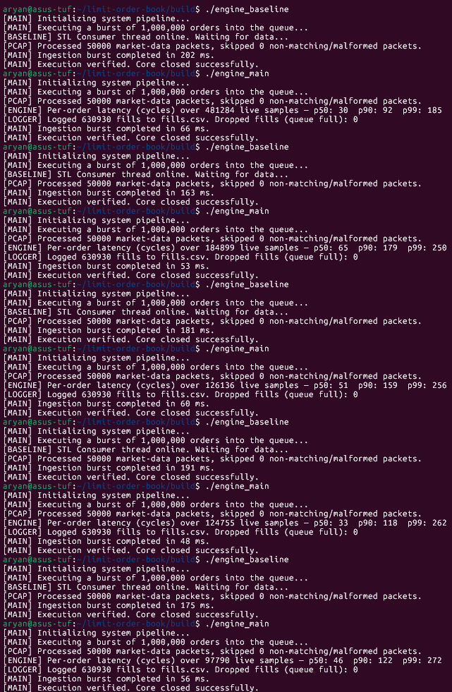
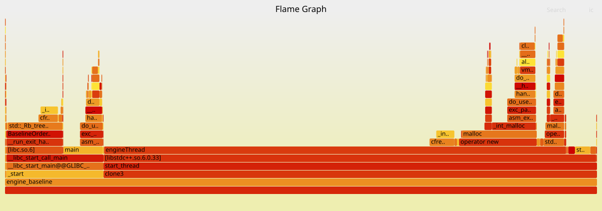
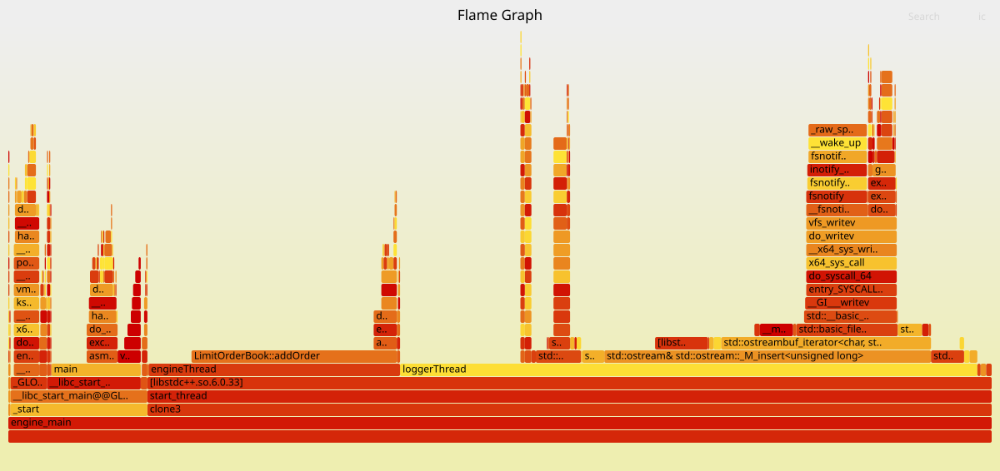
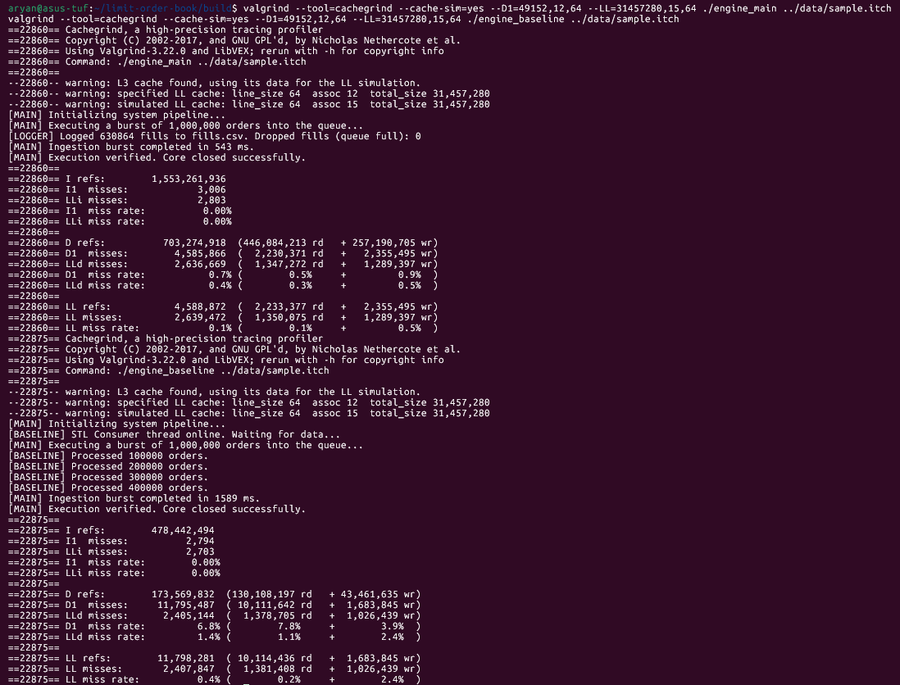

# NanoMatch — Limit Order Book Engine

*Built as a summer project for "NANOMATCH: Ultra-Low Latency Order Matching Engine," run by the Finance & Economics Club (FEC), IIT Guwahati — Mentors: Shubham Rane and Tanishq Kothari.*
[](https://verification.givemycertificate.com/v/792bf75f-1f0a-43c0-a8ec-372197a4e6ba)

A limit order book written in C++20, built to be as fast as possible. It reads NASDAQ ITCH 5.0 binary feeds, PCAP-captured ITCH/MoldUDP64 multicast traffic, or CSV files, matches limit and market orders by price-time priority, and processes them on a dedicated thread pinned to its own CPU core.

---

## Headline result

Ingesting 1,000,000 orders takes **~56.6 ms** natively (**~17.7M orders/sec**), a
**~3.2x** speedup over a std::map-based baseline (**~182.4 ms**, ~5.5M orders/sec) on
PCAP input. The engine's per-order matching latency stays flat at **~10.3 ns** regardless
of book depth, while the baseline degrades from ~12.1 ns to ~24.0 ns as the book fills up.

---

## How it works

A parser thread (run on logical core 2) reads the feed file and pushes orders into a ring buffer. A separate engine thread (run on logical core 4) drains that buffer and runs the matching logic, thereby implementing an SPSC (**S**ingle **P**roducer **S**ingle **C**onsumer) queue. A third, logger thread (run on logical core 6) drains a second SPSC queue of trade fills and writes them to disk. No two threads ever share a lock; they communicate only through atomic reads and writes on their respective queues.

```
Parser Thread (Core 2)  ── [order ring buffer] ──>  Engine Thread (Core 4) ──> [fill ring buffer] ──> Logger Thread (Core 6)
    reads file                                        matches orders                                    writes fills.csv (buffered
  (mmap, zero-copy)                                 (price-time priority)                                ofstream, off hot path)
```

*Note: All three threads are pinned to physical cores such that the parser and engine threads don't share an L2 cache\*, and Core 0 is avoided because the OS routes hardware interrupts there.*

*\* This was verified using the linux command `lscpu -e`*



*Clearly, the logical cores 2, 4 and 6 belong to different physical cores.*

Every match the engine thread produces is also pushed onto a **second, independent lock-free SPSC ring buffer** (`fillQueue`) as a `FillEvent`, drained by the logger thread — this is the trade-reporting path, kept completely separate from the order-ingestion path so that the logger can never add backpressure to matching. See [Trade / fill reporting](#trade--fill-reporting) below.

Orders also carry a **market-order path**: any order routed to the engine with `price == 0` is treated as a market order (`addMarketOrder`) and sweeps the opposite side of the book at whatever price is available, rather than resting if unfilled. Regular limit orders still go through `addOrder`, which continues to reject (and log) any order priced at `0` or `>= MAX_PRICE`, since that check exists specifically to catch limit orders that shouldn't have reached that path.

---

## Why it's fast

**No `std::map`.** The bid and ask sides are just flat arrays indexed by price — `bids[price]` gets you a price level in a single array lookup, regardless of how many other price levels exist. A `std::map` takes O(log N) time per lookup and gets measurably slower as the book fills up. The benchmarks below prove this out.

**Bitsets for best bid/ask tracking.** When a price level empties, the engine needs to find the next best price. Instead of scanning the array, it uses a compact array of 64-bit integers as a bitset, then uses a single CPU instruction (`__builtin_clzll` / `__builtin_ctzll`) to find the next set bit. The scan starts from the current best price, so it rarely looks at more than one word.

**Memory pool, pre-wired upfront.** All order nodes come from a slab of memory allocated at startup with `mmap(MAP_POPULATE)`. `MAP_POPULATE` tells the kernel to wire all the physical pages before any orders arrive, so there are no page faults at runtime. `MADV_HUGEPAGE` then groups that memory into 2 MB pages to reduce TLB pressure during large sweeps.

**32-byte node alignment.** Each `OrderNode` is exactly 32 bytes, so two fit neatly in a 64-byte L1 cache line. Traversing a price level's order queue reads two nodes per cache line fetch.

**Zero-copy file parsing.** All three parsers (CSV, raw ITCH, and PCAP-wrapped ITCH) use `mmap` to map the file into virtual memory directly. There's no `fstream`, no intermediate buffer — the kernel's page cache is the read buffer. ITCH binary messages are decoded by casting a raw pointer straight to a packed struct, plus a byte-swap for big-endian fields; the PCAP path additionally walks the Ethernet/IPv4/UDP/MoldUDP64 envelope before handing each embedded message to the same ITCH decoder.

**Heap-allocated book instances in benchmarks.** `LimitOrderBook` owns two `std::array<PriceLevel, MAX_PRICE>` (one per side), an `orderMap` of `MAX_ORDERS` entries, and its own `MemoryPool` — several megabytes of state in total. That's too large to construct safely on the stack of a benchmark function, so every `BENCHMARK` fixture that needs a fresh book (`BM_EngineScaling`, `BM_PingPong`, `BM_LevelSweep`) constructs it via `std::make_unique<LimitOrderBook>()` instead, keeping the object on the heap while everything inside it is still contiguous, pre-wired memory.

---

## Trade / fill reporting

Every time `addOrder` or `addMarketOrder` produces a match, it emits a `FillEvent`:

```cpp
struct FillEvent {
    uint64_t restingOrderID;
    uint64_t aggressorOrderID;
    uint32_t price;
    uint32_t fillQuantity;
    Side     aggressorSide;
};
```

This is pushed onto its own `RingBuffer<FillEvent, FILL_QUEUE_CAPACITY>` (`fillQueue`), completely separate from the order-ingestion ring buffer described above. Same lock-free SPSC pattern: the engine thread is the sole producer, and a dedicated **logger thread** (pinned to a core other than 0/2/4) is the sole consumer, draining it via `popFill(FillEvent&)`.

The logger thread loops on `popFill`, appending each `FillEvent` as a CSV row (`restingOrderID,aggressorOrderID,price,fillQuantity,aggressorSide`) to `fills.csv` via a plain buffered `ofstream`. It deliberately avoids the zero-copy/mmap tricks used elsewhere in this project — the entire point of routing fills through a separate queue is to let this thread be as slow as it needs to be without ever stalling the engine thread. On shutdown, `main.cpp` joins the engine thread first (the sole producer), *then* signals the logger to stop, so the logger's final drain pass is guaranteed to pick up every fill the engine produced before market close.

If the fill queue ever fills up (capacity `FILL_QUEUE_CAPACITY`, currently sized the same as the order queue) faster than the logger can drain it, the engine does **not** block or slow down: it drops the fill record and increments `droppedFillCount`. The logger prints this count (via `getDroppedFillCount()`) on shutdown, so a non-zero value is a signal the logger needs to be made faster or the queue larger, not a silent data-loss bug.

`BaselineMain.cpp` has no equivalent — `BaselineOrderBook` doesn't emit `FillEvent`s at all, since fill reporting is part of the optimized engine's design, not the baseline being benchmarked against.

---

## Benchmark results

### Test hardware

| | |
|---|---|
| CPU | Intel Core i7-14650HX (12 physical cores, 24 threads, 1 socket), calibrated TSC 2233.11 MHz |
| Cache | L1d 48 KiB ×12 (576 KiB total) · L1i 32 KiB ×12 (384 KiB total) · L2 2048 KiB ×12 (24 MiB total) · L3 30720 KiB (30 MiB) |
| RAM | 7.6 GiB |
| OS | WSL2 (Ubuntu 24.04) on Windows, kernel 6.18.33.1-microsoft-standard-WSL2 |
| Compiler | g++ 13.3.0 (Ubuntu 13.3.0-6ubuntu2~24.04.1) |
| Build flags | `-O3 -march=native -mtune=native -flto` |

> WSL2 runs on a lightweight Hyper-V VM rather than bare metal — core pinning via `pthread_setaffinity_np` targets *virtual* CPU IDs exposed by WSL2, which are backed by, but not guaranteed to map 1:1 onto, physical Windows-scheduled cores. This is disclosed as a methodology caveat.

Each fixture runs 20 times; p50/p90/p99 are reported. See [Reproducing the results](#reproducing-the-results) for exact commands.

### Scaling: Engine vs. std::map baseline

| Book depth | Baseline p50 | Baseline p90 | Baseline p99 | Engine p50 | Engine p90 | Engine p99 |
|---|---|---|---|---|---|---|
| 100 levels | 12.1 ns | 14.9 ns | 18.0 ns | 10.27 ns | 10.74 ns | 13.23 ns |
| 1,000 levels | 13.9 ns | 17.6 ns | 23.7 ns | 10.28 ns | 10.74 ns | 12.92 ns |
| 10,000 levels | 17.7 ns | 18.5 ns | 19.7 ns | 10.29 ns | 10.81 ns | 13.01 ns |
| 100,000 levels | 24.0 ns | 27.8 ns | 33.2 ns | 10.30 ns | 10.76 ns | 11.64 ns |

The engine's per-op latency stays essentially flat (~10.3 ns p50) regardless of book depth, while the baseline's p50 grows from 12.1 ns to 24.0 ns as the book fills — O(1) array lookup vs. O(log N) tree traversal playing out exactly as expected.

One thing to flag about this table: `BM_EngineScaling` times an `addOrder` immediately followed by a `cancelOrder` on every iteration, whereas `BM_BaselineScaling` only times a single `addBid`. So the engine column is two operations sitting next to a baseline column that's one. The flat-vs-growing *shape* across book depth is still the right thing to compare — that's the actual point of the table — but the absolute ns numbers aren't a clean one-op-to-one-op measurement. Worth re-running with a single-op engine fixture if you want numbers that hold up to that level of scrutiny.

### Other fixtures

**Ping-Pong** — a BUY order lands and immediately matches a resting SELL. This is the full lifecycle: insert, match, remove.

| p50 | p90 | p99 |
|---|---|---|
| 71.7 ns | 74.5 ns | 75.1 ns |

**Level Sweep** — one aggressive SELL sweeps through 100 resting BUY orders at the same price. 100 nodes removed in a single `addOrder` call.

| p50 | p90 | p99 |
|---|---|---|
| 476 ns | 484 ns | 488 ns |

That's about 4.76 ns per node swept (p50), with low variance (~1.93% CV) — the pool and cache alignment doing their job.

---

## End-to-end ingestion throughput

1,000,000 orders read from `data/sample.pcap` (Ethernet/IPv4/UDP/MoldUDP64-wrapped ITCH, 50,000 packets), parsed, and matched — engine vs. std::map baseline, native (no profiler attached). Runs were interleaved to control for thermal and scheduling drift.

| Run | Baseline (ms) | Engine (ms) |
|---|---|---|
| 1 | 202 | 66 |
| 2 | 163 | 53 |
| 3 | 181 | 60 |
| 4 | 191 | 48 |
| 5 | 175 | 56 |
| **Average** | **~182.4 ms** | **~56.6 ms** |

**~3.2x speedup**, or roughly **~17.7M orders/sec** for the engine vs. **~5.5M orders/sec** for the baseline. These numbers are on PCAP input, which carries real per-packet parsing overhead (Ethernet/IPv4/UDP/MoldUDP64 envelope on top of each ITCH message). Running against `data/sample.itch` directly removes that overhead and produces higher throughput — the PCAP path is the default because it reflects how data actually arrives off an exchange feed.

`engine_main` also prints a live per-order dispatch latency for the run, in raw CPU cycles (not nanoseconds — `main.cpp` doesn't convert these). Across the five runs above, sample counts ranged from 97,790 to 481,284 "live" samples (orders dispatched by the engine thread *while* the parser was still feeding it, before the final drain) — this range reflects how the SPSC queue happened to interleave with the parser on a given run, not a fixed order count, so treat these as illustrative rather than a stable percentile:

| Run | Live samples | p50 (cycles) | p90 (cycles) | p99 (cycles) |
|---|---|---|---|---|
| 1 | 481,284 | 30 | 92 | 185 |
| 2 | 184,899 | 65 | 179 | 250 |
| 3 | 126,136 | 51 | 159 | 256 |
| 4 | 124,755 | 33 | 118 | 262 |
| 5 | 97,790 | 46 | 122 | 272 |

At this machine's calibrated ~2.233 GHz TSC, that's roughly 13–29 ns p50 and 83–122 ns p99 across runs — noisier than the isolated `engine_bench` numbers above, since this is the real dispatch loop competing with the parser and logger threads rather than an isolated microbenchmark.



---

## Profiling evidence

### Flame graphs

**Baseline**: The systemic overhead of dynamic memory and standard library containers is clearly visible across the entire process. On the left, the object teardown (`BaselineOrderBook::~BaselineOrderBook`) forms a massive tower dominating a large portion of the samples, heavily burdened by `std::_Rb_tree` node deallocations (`cfree`, `_int_free`). On the right, during the actual matching phase (`engineThread`), the hot path is continuously interrupted by dynamic memory requests, with `operator new` and `malloc` clearly visible at the top of the execution stack.



**Optimized**: The workload is cleanly divided into three columns: `main` (parsing, pinned to core 2, left), `engineThread` (center), and `loggerThread` (right). Crucially, the `engineThread`'s hot path (`LimitOrderBook::addOrder`) is completely flat — there is not a single `malloc`, `free`, or allocator frame present. The heavy STL and I/O overhead (`std::ostream`) is visibly corralled entirely within the `loggerThread`, proving that asynchronous trade reporting never stalls the core matching engine.



### Cachegrind

| Metric | Baseline | Optimized |
|---|---|---|
| D1 misses (absolute) | 11,792,974 | 4,585,636 |
| D1 miss rate | 6.8% | 0.7% |
| LLd miss rate | 1.3% | 0.4% |

Cache parameters were set to this machine's real L1d/L3 sizes rather than left at generic defaults. The D1/LL miss-rate columns are the point of this table: the optimized build misses far less per data access, the direct cache-locality payoff of flat price-indexed arrays and pool-allocated, 32-byte-aligned nodes instead of rb-tree/list traversal.

One metric deliberately left out: raw total instruction count (`Ir`). An earlier run showed `engine_main` executing more total instructions than `engine_baseline` under cachegrind (1.55B vs. 475M), which looked contradictory — so it was re-run on a verified clean `-O3 -march=native -flto` rebuild. The clean rebuild reproduced the same gap almost exactly, pointing to the actual cause: `engine_main` runs three threads, two of which (`engineThread`, `loggerThread`) spin on `_mm_pause()` while waiting on an empty queue, versus one spinning consumer thread in the baseline. Cachegrind serializes and instruments every one of those spin iterations, and its own slowdown means the queues starve far more than they do natively — so the extra always-spinning thread inflates `Ir` in a way that has nothing to do with the matching engine's actual work. The D1/LL numbers above aren't affected by this, which is why they're the ones reported here.



---

## Reproducing the results

Everything in this README — benchmark tables, ingestion throughput numbers, profiling evidence — can be reproduced from scratch with the commands below. No external data is needed; the generators create everything locally.

### 1. Build

```bash
cd limit-order-book
rm -rf build
mkdir build && cd build
cmake .. -DCMAKE_BUILD_TYPE=Release
make -j$(nproc)
```

This produces three binaries inside `build/`: `engine_main`, `engine_baseline`, and `engine_bench`.

### 2. Generate test data

```bash
cd ..   # back to limit-order-book/
python3 scripts/pcap_generator.py    # creates data/sample.pcap  — 1M ITCH orders wrapped in Ethernet/IPv4/UDP/MoldUDP64
python3 scripts/itch_generator.py    # creates data/sample.itch  — same orders as raw ITCH binary
python3 scripts/csv_generator.py     # creates data/orders.csv   — same orders as CSV
```

The default feed for both `engine_main` and `engine_baseline` is `data/sample.pcap`. All three formats produce 1,000,000 orders.

### 3. Benchmark tables (scaling, ping-pong, level sweep)

```bash
cd build
./engine_bench
```

Runs all Google Benchmark fixtures (20 repetitions each) and prints the full results table. The numbers in the scaling table, ping-pong table, and level sweep table all come from this output. The binary also prints its calibrated TSC frequency at the top — divide the cycle counts in `BM_EngineScaling`'s counter fields by this value to convert to nanoseconds.

### 4. End-to-end ingestion throughput

Run baseline and engine alternately to control for thermal and scheduling drift:

```bash
cd build
./engine_baseline && ./engine_main
./engine_baseline && ./engine_main
./engine_baseline && ./engine_main
./engine_baseline && ./engine_main
./engine_baseline && ./engine_main
```

Each `engine_baseline` run prints `[MAIN] Ingestion burst completed in X ms` — that's the baseline column. Each `engine_main` run prints the same line — that's the engine column. The live per-order latency percentiles (in cycles) are printed by `engine_main` just above the ingestion time line.

### 5. Cachegrind

Rebuild with frame pointers preserved (adds `-fno-omit-frame-pointer`, small runtime cost):

```bash
cd limit-order-book
rm -rf build && mkdir build && cd build
cmake .. -DCMAKE_BUILD_TYPE=Release -DENABLE_PROFILING=ON
make -j$(nproc)
```

Then run — use `sample.itch` rather than `sample.pcap` here to keep the valgrind run time manageable:

```bash
valgrind --tool=cachegrind --cache-sim=yes --D1=49152,12,64 --LL=31457280,15,64 ./engine_main ../data/sample.itch
valgrind --tool=cachegrind --cache-sim=yes --D1=49152,12,64 --LL=31457280,15,64 ./engine_baseline ../data/sample.itch
```

The `--D1` and `--LL` parameters match this machine's actual L1d/L3 topology (48 KiB 12-way; 30 MiB 15-way after Valgrind's power-of-two rounding). Leave them as-is for a like-for-like comparison, or adjust to your machine's topology. The `D1 miss rate` and `LLd miss rate` lines in the output correspond directly to the numbers in the Cachegrind table above.

### 6. Flame graphs

Requires `perf` and a one-time clone of Brendan Gregg's FlameGraph toolkit, cloned **inside** the repo:

```bash
git clone https://github.com/brendangregg/FlameGraph.git
```
> **WSL2 note:** `perf` isn't installed by default, and the kernel-specific package Ubuntu normally suggests (`linux-tools-$(uname -r)`) won't exist for WSL2's custom kernel string. Install `linux-tools-generic` instead, then locate and symlink the real binary:
> ```bash
> sudo apt install linux-tools-generic
> find /usr/lib/linux-tools* -name perf
> sudo ln -sf /usr/lib/linux-tools/<version>-generic/perf /usr/local/bin/perf
> ```
> You may also need to relax `perf_event_paranoid` (`echo -1 | sudo tee /proc/sys/kernel/perf_event_paranoid`) before `perf record` will run.

Use the same `-DENABLE_PROFILING=ON` build from step 5, then:

```bash
cd limit-order-book/build

perf record -F 4000 --call-graph fp -e cpu-clock -g -- ./engine_main ../data/sample.itch
perf script -i perf.data | ../FlameGraph/stackcollapse-perf.pl | ../FlameGraph/flamegraph.pl > ../docs/optimised_flamegraph.svg

perf record -F 4000 --call-graph fp -e cpu-clock -g -- ./engine_baseline ../data/sample.itch
perf script -i perf.data | ../FlameGraph/stackcollapse-perf.pl | ../FlameGraph/flamegraph.pl > ../docs/baseline_flamegraph.svg
```

Open the `.svg` files in a browser — they are interactive. The optimized flame graph should show three columns (`main`/parsing, `engineThread`, `loggerThread`) with no allocator frames inside `engineThread`. The baseline should show a large destructor tower on the left and `malloc`/`operator new` visible in the matching path on the right.

---

## File structure

```
├── LimitOrderBook.hpp/cpp   matching engine (limit + market orders, fill reporting)
├── Order.hpp                Order, OrderNode, PriceLevel structs
├── MemoryPool.hpp           mmap slab allocator
├── RingBuffer.hpp           lock-free SPSC queue (used for both orders and fills)
├── CSVParser.hpp            zero-copy CSV parser
├── ITCHParser.hpp           zero-copy ITCH 5.0 binary parser
├── PCAPITCHParser.hpp       zero-copy PCAP parser (Ethernet/IPv4/UDP/MoldUDP64 → ITCHParser)
├── BaselineOrderBook.hpp    std::map reference implementation (benchmarking only)
├── benchmark.cpp            Google Benchmark suite
├── main.cpp                 entry point; parser/engine/logger thread setup, timing
├── BaselineMain.cpp         entry point for the std::map baseline binary
├── CMakeLists.txt           build config (-O3 -march=native -flto, optional ENABLE_PROFILING)
├── docs/
└── scripts/
    ├── csv_generator.py     generates 1M synthetic orders as CSV
    ├── itch_generator.py    generates 1M synthetic orders as ITCH binary (~38 MB)
    └── pcap_generator.py    generates 1M synthetic ITCH orders wrapped in Ethernet/IPv4/UDP/MoldUDP64, as a .pcap capture
```

---

## Build & run

Requires CMake ≥ 3.14, a C++20 compiler, and Linux (uses `mmap`, `pthread_setaffinity_np`, `_mm_pause`).

```bash
mkdir build && cd build
cmake .. -DCMAKE_BUILD_TYPE=Release
make -j$(nproc)
```

Google Benchmark is fetched automatically at configure time.

To switch between CSV, raw ITCH, and PCAP, pass a path as the first argument to `engine_main` / `engine_baseline` — the extension (`.csv`, `.itch`, `.pcap`) determines which parser is used. Without an argument, both default to `../data/sample.pcap`.

```bash
./engine_main                        # defaults to ../data/sample.pcap
./engine_main ../data/sample.itch    # raw ITCH feed
./engine_main ../data/orders.csv     # CSV feed
```

---

## Supported feed formats

**CSV** — one order per line: `orderID,price,quantity,side` (0 = buy, 1 = sell).

**NASDAQ ITCH 5.0** — binary. Handles message types `A` (add order), `F` (add order with attribution), and `D` (delete order). Everything else is skipped.

**PCAP (Ethernet/IPv4/UDP/MoldUDP64-wrapped ITCH)** — a `.pcap` capture containing NASDAQ TotalView-ITCH messages carried over MoldUDP64 multicast, the way they'd actually arrive off an exchange feed. `PCAPITCHParser` walks each captured packet's classic pcap record header, verifies the Ethernet frame (with optional single 802.1Q VLAN tag), IPv4 header, and UDP header, then unpacks the MoldUDP64 block's message count and hands each embedded ITCH message to the same `ITCHParser::processMessage` used by the raw `.itch` path — so the matching logic downstream is identical regardless of which of the three formats the data arrived in. Non-Ethernet link types, non-IPv4/non-UDP packets, and truncated captures are skipped and counted, not treated as fatal.

**Market orders** — the engine's `addMarketOrder` path is triggered whenever an order reaching `main.cpp`'s dispatch has `price == 0` and `quantity > 0`; it sweeps the opposite side of the book at whatever price is resting rather than joining the book unfilled. None of the generators currently emit `price == 0` rows, so this path exists in the engine but isn't exercised by the bundled sample data — feed it a CSV/ITCH/PCAP row with price `0`, or call `addMarketOrder` directly, to use it. `BaselineOrderBook` has no equivalent: a `price == 0` row reaching `BaselineMain.cpp` is inserted as an ordinary resting order at price 0 rather than swept, so the two binaries are only benchmark-comparable as long as the feed never contains price-0 rows.

**Cancellations** — signalled by `quantity == 0` on the incoming `Order`/CSV row; the ITCH delete-order (`D`) message (raw or PCAP-wrapped) maps to this the same way, with one gap noted in Known issues below.

---

## Known issues

`ITCHParser`'s delete-order (`'D'`) handler only sets `orderID` and `quantity = 0`, leaving `price`/`side` default-initialized. `engine_main`'s cancel path doesn't need them (it looks the order up by ID alone via `orderMap`), but `engine_baseline`'s does, so a `'D'` message reaching the baseline binary wouldn't cancel correctly. None of the bundled generators emit delete rows, so this hasn't come up in practice and doesn't affect any benchmark numbers — noting it here for anyone feeding either binary a feed with real cancellations.

---

## Limitations

- Prices must be integers between 1 and 100,000 inclusive (`MAX_PRICE = 100,001`); orders at or above the ceiling, or priced at exactly 0 when they reach `addOrder` directly, are dropped and logged to stderr.
- Order IDs must be below 1,100,001 (the size of the order map array) — this isn't currently enforced with a bounds check, so an out-of-range ID is undefined behaviour rather than a clean rejection.
- Linux only — `mmap`, `pthread_setaffinity_np`, and `__builtin_*` intrinsics are used throughout.
- The order-ingestion ring buffer is single-producer, single-consumer only.
- The logger thread is pinned to logical core 6 in `main.cpp` — if your machine has fewer cores, or 6 happens to collide with an interrupt-heavy or otherwise pinned core, adjust the `CPU_SET` call before relying on the pinning.
- `fills.csv` is truncated and rewritten on every run of `engine_main` — there's no append-across-runs or rotation logic.
- No persistence. Everything lives in memory; a crash loses the book state.
- Memory pool exhaustion (>1,100,000 live orders) is logged to stderr and the order is silently dropped rather than causing a resize/reallocation.
- `LimitOrderBook` is large enough (multi-megabyte `bids`/`asks`/`orderMap` arrays) that it should always be heap-allocated (e.g. via `std::make_unique`) rather than placed on the stack — already how `benchmark.cpp` and both entry points construct it, but worth keeping in mind if you add new call sites.
